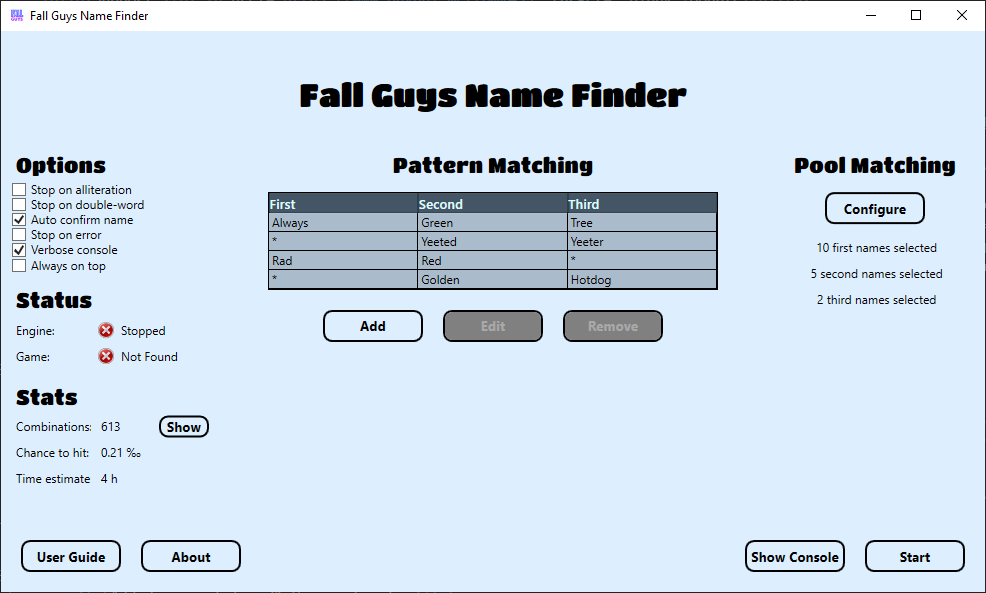

# Fall Guys Name Finder
Automatically rerolls your name until it matches specific patterns.
 
 
 
## Features
- User-definable pattern matching
  - Dropdown lists with all possibilities
  - Option to use wildcards
- User-definable pool matching
  - Select a bunch of first, second and third names
  - Any combination will match
- Detects alliterations
- Detects double-words
- Detects if the amazon link-page got opened
- Avoids idle-timeouts upon matches
- Support for multiple screen sizes, including 16:9 and 21:9
- Windowed mode support
- Very robust engine (100% correct parsing rate even under sub-ideal conditions)
  - Modifies screenshot area on failure
  - Modifies color information on failure
  - Various monochrome transformations for optimal OCR conditions
  - Artifact filtering and word extraction
  - Case insensitivity
  - Fuzzy matching upon OCR failure
- Swiss made

## Is it legal
Yes. Indirectly approved by Oliver himself.

## Download
[v 2.2](https://github.com/Tom852/FallGuysNameFinder/releases/download/v2.2/FallGuysNameFinder.zip) (09.10.2021)

[v 2.1](https://github.com/Tom852/FallGuysNameFinder/releases/download/v2.1/FallGuysNameFinder.zip) (30.09.2021)

[v 2.0](https://github.com/Tom852/FallGuysNameFinder/releases/download/v2.0/FallGuysNameFinder.zip) (29.09.2021)

[v 1.0](https://github.com/Tom852/FallGuysNameFinder/releases/download/v1.0/FallGuysNameFinder.zip) (11.09.2021)

## Bugs and feature requests
Feel free to get in touch with me if there are any bugs or if you have feature requests.